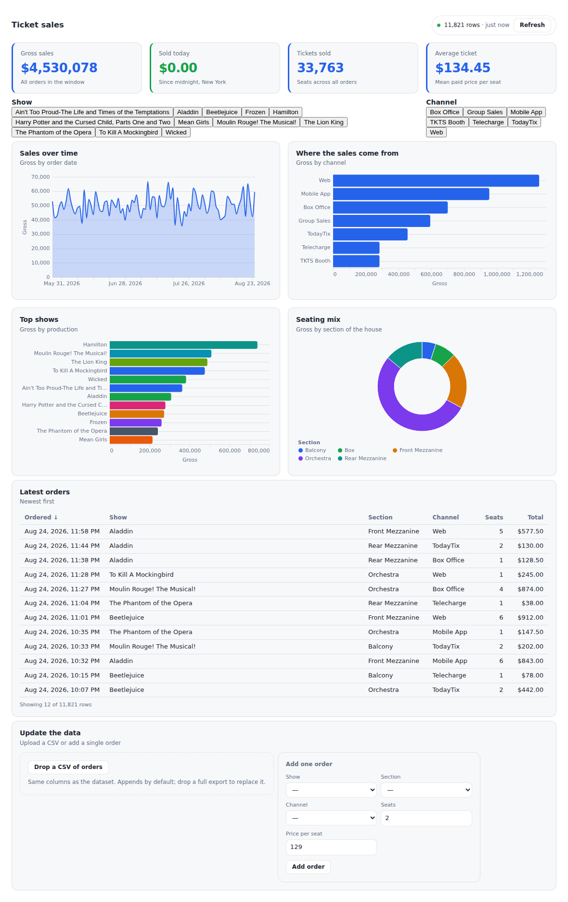

# mcp-a2ui-vega

**An MCP App whose UI is A2UI, and whose charts are Vega-Lite.**

Ask Claude for the ticket sales dashboard and it appears in the conversation:
metrics, charts, a table of the latest orders, a place to drop a CSV. Then ask
for changes — *make the sales one a line chart and show today's sales in green*,
*add a heatmap of when people buy* — and the dashboard is edited in place, not
redrawn from scratch. Drop a CSV into it, or append rows from a script, and every
chart moves on its own.

The dashboard is not a picture the model produced. It is a component tree the
agent composed from a typed catalog, rendered by a real A2UI renderer, bound to a
dataset it keeps re-reading.

<p align="center"></p>

## What it is made of

| Piece | What it does |
|---|---|
| [`packages/catalog`](packages/catalog) | The A2UI catalog — component APIs, functions, and the JSON-Schema document generated from them. The contract between agent and renderer. |
| [`packages/renderer`](packages/renderer) | The MCP App view: React + [`@a2ui/react`](https://www.npmjs.com/package/@a2ui/react), a Vega-Lite implementation of the catalog, and the [MCP Apps](https://modelcontextprotocol.io/seps/1865-mcp-apps-interactive-user-interfaces-for-mcp) bridge. |
| [`packages/server`](packages/server) | A Cloudflare Worker: the MCP server, the dataset store, the saved-widget library, and the `ui://` resource. |
| [`data`](data) | The dataset, grounded in the real Broadway weekly grosses. |
| [`skill/a2ui-dashboards`](skill/a2ui-dashboards) | The skill that teaches an agent to compose and recompose these dashboards well. |
| [`tools`](tools) | Dataset builder, live-append feed, host harness, end-to-end test. |

**No API keys.** There is no model in this repo. The agent is whichever MCP host
connects; the server stores rows and composes JSON; the renderer is
deterministic. The only credentials involved are the Cloudflare ones you need to
deploy the Worker.

## The three ways A2UI and MCP Apps compose

Google's [A2UI and MCP Apps](https://developers.googleblog.com/a2ui-and-mcp-apps/)
post describes three patterns. This repo implements two of them, from one
codebase:

- **A2UI inside an MCP App** (the main path). The app bundle carries its own
  A2UI renderer, so a host that has never heard of A2UI — Claude today — still
  gets generative UI. `ui://a2ui-vega/dashboard`.
- **A2UI over MCP resources** (the portable path). The same dashboard is served
  as `application/a2ui+json` at `a2ui://dashboard/ticket_sales`. A host with its
  own A2UI renderer can draw it natively, no iframe involved.

The payload is the portable artifact; the MCP App is how everyone else gets to
see it.

## How a dashboard stays live

```
agent ──render_dashboard──▶ server ──A2UI messages in _meta──▶ view
                                                                │
view ──get_dataset_rows (app-only tool)──▶ server ──rows────────┘
                                                                │
                                              updateDataModel ──┘  every chart,
                                                                   tile and table
                                                                   re-renders
```

Two decisions do most of the work:

**Rows never travel through the model.** `render_dashboard` returns a layout and
a row count. The view fetches rows itself with `get_dataset_rows`, a tool whose
`_meta.ui.visibility` is `["app"]` so it never appears in the agent's tool list.
Twelve thousand orders belong in a chart, not in a context window.

**A dashboard is components, not an image.** Changing one chart is one
`update_dashboard` naming one id. The user's filters, sort order and scroll
position survive, because nothing else was touched.

## Any chart, including ones the catalog never named

`VegaChart` takes a whole Vega-Lite spec as a property. A heatmap, a box plot, a
faceted small-multiple — none of them are in the catalog, and all of them work,
because the catalog's boundary is *kinds of component*, not *kinds of chart*.

When the user likes one, `save_widget` keeps it by name, and
`render_dashboard({widgets: ["sales_by_hour_heatmap"]})` brings it back in a
later conversation — still bound to the live dataset, so it updates like
everything else.

## The data

`data/ticket_sales.csv` is one row per ticket order across twelve Broadway
shows. The shows, their theatres, house sizes, week-by-week capacity and price
levels are **real**, from the [Broadway weekly grosses
dataset](https://github.com/rfordatascience/tidytuesday/tree/master/data/2020/2020-04-28)
(Playbill, via TidyTuesday). The individual orders are modelled from those
figures, because the source is weekly and aggregate. [`data/README.md`](data/README.md)
says exactly which parts are which.

```bash
npm run data:build                    # rebuild, 90 days ending now
npm run data:append -- --watch 10     # a live feed: new orders every 10s
```

Point that at a deployment with `--url https://your-worker.workers.dev` and watch
the dashboard move while you are looking at it.

## Run it

```bash
npm install
npm run data:build          # build the dataset (downloads the source CSV once)
npm run build               # catalog → renderer → single-file app → worker
npm run dev -w @mcp-a2ui-vega/server
```

Then open <http://localhost:8788/app.html> for the dashboard on its own, or
<http://localhost:8788/> for the connection instructions.

**Install it in Claude.** Deploy (below), then add the Worker's `/mcp` URL as a
custom connector in Claude's settings, and add the skill in
[`skill/a2ui-dashboards`](skill/a2ui-dashboards). Ask for the ticket sales
dashboard.

## Deploy

The Worker is the only thing that has to be hosted. GitHub Pages gets the
standalone demo.

```bash
wrangler kv namespace create DATA        # put the id in packages/server/wrangler.toml
npm run deploy -w @mcp-a2ui-vega/server
```

Or push to `main` and let [the workflow](.github/workflows/deploy.yml) do it,
with these repository secrets:

| Secret | What it is |
|---|---|
| `CLOUDFLARE_API_TOKEN` | A token with *Edit Cloudflare Workers* permission |
| `CLOUDFLARE_ACCOUNT_ID` | Your account id |
| `CLOUDFLARE_KV_NAMESPACE_ID` | The id printed by `wrangler kv namespace create DATA` |

## Test

```bash
npm test                                       # dataset and catalog checks
npm run dev -w @mcp-a2ui-vega/server           # terminal 1
python3 -m http.server 8479                    # terminal 2, at the repo root
node tools/e2e.mjs                             # a real browser, the real protocol
```

`tools/e2e.mjs` drives [`tools/harness.html`](tools/harness.html) — a hand-written
MCP Apps host, ~120 lines, deliberately not sharing code with the app so a
protocol mistake cannot pass unnoticed in both. It checks the things a type
checker cannot: that the dashboard draws, that recomposing colours one tile
without disturbing the rest, that appended rows arrive unasked, that a filter
moves the metrics and the table together, and that a saved widget comes back.

## Licence

MIT.
